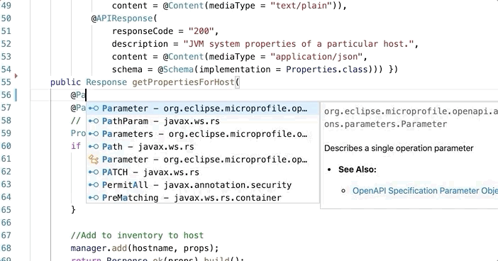

# MicroProfile Language Server Demo

Demo for MicroProfile Language Server using VS Code

## Setup
Build the following projects and install the extension in VS Code.
- https://github.com/MicroShed/microprofile-language-server
- https://github.com/MicroShed/microprofile-lsp-client-vscode

## MicroProfile OpenAPI
1. Clone OpenAPI guide
```
git clone https://github.com/OpenLiberty/guide-microprofile-openapi.git
```
2. In VS Code, File -> Open and open the `guide-microprofile-openapi/finish` folder.

#### OpenAPI Annotation Source Actions:
1. Navigate to `src/main/java/io/openliberty/guides/inventory/InventoryResource.java`
1. Delete the entire `@Operation` annotation above `getPropertiesForHost`.
1. Right-click anywhere in the class, choose `Source Action...`, `Generate OpenAPI Annotations`
1. An `@Operation` annotation is generated with fields that you can fill in.


#### OpenAPI Annotation Code Complete:
1. Delete the `@Operation` annotation.  Press Control Space and start typing `@`.  Select the `Operation` code complete, which inserts a code snippet with fields that you can fill in.

1. Delete the `@Parameter` annotation.  Press Control Space and start typing `@`.  Select the `Parameter` code complete, which inserts a code snippet with fields that you can fill in.


## MicroProfile Rest Client

1. Clone Rest Client guide
```
git clone https://github.com/OpenLiberty/guide-microprofile-rest-client.git
```

#### Rest Client Injection - Diagnostics and Quick Fix:
1. Navigate to `src/main/java/io/openliberty/guides/inventory/InventoryManager.java`.
1. Delete `@Inject` above `defaultRestClient` which is registered as a Rest Client. A warning appears. Right-click the warning in the Problems pane to add the missing annotation.

1. Delete `@RestClient` above `defaultRestClient`. A warning appears. Right-click the warning in the Problems pane to add the missing annotation.

1. Delete both `@Inject` and `@RestClient`. A warning appears. Right-click the warning in the Problems pane to add the missing annotations.

1. Navigate to `src/main/java/io/openliberty/guides/inventory/client/SystemClient.java`. Delete `@RegisterRestClient`. A warning appears for this interface because it is being injected elsewhere but is not registered as a Rest Client.


### MicroProfile Health

1. Clone Health guide
```
git clone https://github.com/OpenLiberty/guide-microprofile-health.git
```
2. In VS Code, File -> Open and open the `guide-microprofile-health/finish` folder.

#### Diagnostics and Quick Fix:
1. Navigate to `src/main/java/io/openliberty/guides/inventory/InventoryLivenessCheck.java`
1. Delete the `@Liveness` annotation.  Notice the warning that appears.
1. In the Problems panel, right-click the warning and choose "Add missing @Liveness annotation"

1. Navigate to `src/main/java/io/openliberty/guides/inventory/InventoryReadinessCheck.java`
1. Delete the `@Readiness` annotation.  Notice the warning that appears.
1. In the Problems panel, right-click the warning and choose "Add missing @Readiness annotation"

1. Delete the text `implements HealthCheck`.  Notice the warning that appears.
1. In the Problems panel, right-click the warning and choose "Add missing HealthCheck interface"


#### Code Complete:
1. Delete the `@Readiness` annotation.  Then press Control Space and type `@`.
1. Notice the `Liveness`, `Readiness`, and `Health` code competion suggestions prioritized at the top of the list, and they have additional info.


